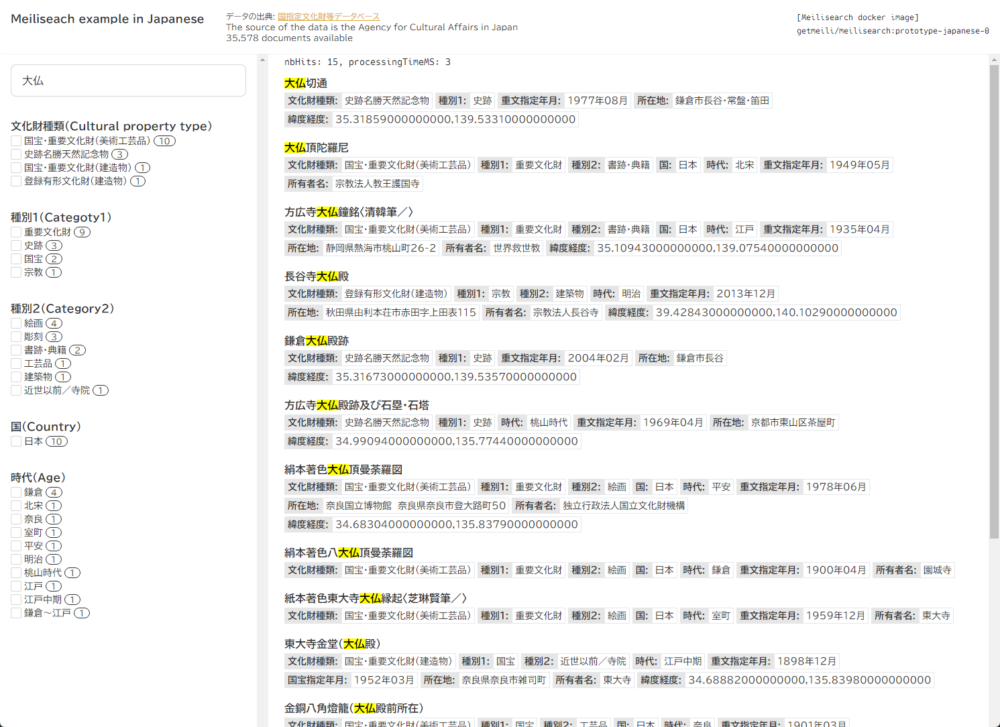

```bash
curl -H "Authorization: Bearer hoge" -H "Content-Type: application/json" -X PUT localhost:7700/indexes/cultural-properties/settings/filterable-attributes -d '["category_1", "category_2", "category_3", "country", "age", "prefecture", "owner", "administrator", "important_cultural_property_year","_geo"]'
```
